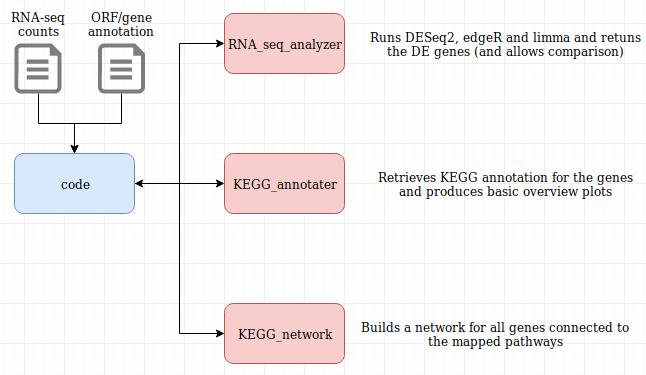
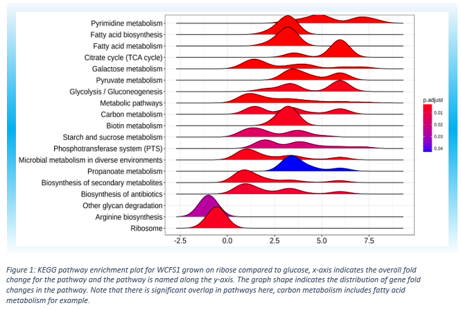

# RNA-seq pipeline
**Authors:** *Rick Beeloo, Koen van der Heide & Thomas Reinders* <br>
**Goal:** *Simple R script to identify RNA reads and deliver biological relevant data.*

***
## Describing the pipeline
**Global overview**



**RNA seq processing**

The main script (`main_code.R`)  reads the RNA-seq data and the annotation hereof. Then this data will be fed to the `RNA_seq_analyzer` class, like so:
```R
wcfs1 <- new('RNA.seq.analyzer',count.data[,1:4], anno)
```
First we filter for low counts (as these are not meaningful). Hereafter we can run [DESeq2](https://bioconductor.org/packages/release/bioc/html/DESeq2.html), [edgeR](https://bioconductor.org/packages/release/bioc/html/edgeR.html) or [limma](http://bioconductor.org/packages/release/bioc/html/limma.html) separately or all at once (please see the code). This will perform all the steps necessary to obtain three sets of DE genes (one for each package). These will include normalization, dispersion estimates and GLM fitting. The results of these packages will then be formatted to a common data frame (i.e. same header for the same data and same p-value correction), which looks like this:
```
              pvalue    adjpvalue       logFC
lp_0001 0.5935160931 0.7216653664 -0.09095857
lp_0002 0.1901134166 0.3198894710 -0.20621807
..etc...
```
As there is a lot of debate around "what is the best package" we choose to add the functionality to draw a venn diagram for the three packages showing the overlapping and non-overlapping genes. We chose to proceed working with the edgeR result, however we could have obtained the core (i.e intersect) of all packages using `wcfs1@venn.data$limmaedgerdeseq2`. 

**Kegg analysis**

We initially chose the [ClusterProfiler](http://bioconductor.org/packages/release/bioc/html/clusterProfiler.html) package for this task. Although multiple plots were useful (such as the rigdeplot, emmaplot and heatplot) (see part II of the code), the enrichment was not that reliable as we only had orthologous genes. Hence, a key pathway, the pentose phosphote phatway, was not significantly enriched despite it contained genes with fold changes >8 (rbsK, rbsU, rbsR). That's why we started writing our own code. We accommodated this code in the `kegg_annotater` class. This first retrieves all KEGG data for the organism in question, in this case for 'lpl' (*Lactobasillus plantarum*). This information will then be coupled to the whole gene set and the DE gene set. Then we filtered for pathways for which we knew were relevant, such as glycolysis, pentose phospate pathway, pyruvate etc. (see code for the full list). We plotted the spread of fold changes in these pathways. We really liked the `cnetplot` produced by ClusterProfiler, however, as stated previously, this did not include all pathways we were interested in and did not allow for any felxibility (as we could not change colors, force between nodes, edge widths etc.) Therefore we also wrote the `kegg_network` class which uses the [NetworkD3](https://christophergandrud.github.io/networkD3/) package. This roughly produces the same plot as `cnetplot` but this time we have the flexibility to change all the desired parameters and one major advantage of using networkD3 instead to igraph is that we can easily export this to a `.svg` file (Which is nice for a poster!). 

***

## The choice to use Classes
We initially didn't even knew that R supported Object Orientated (OO) programming. After some reading we found out that there are different 'kinds' of objects, such as S3, S4 and R5 ([R OO page](https://www.ebi.ac.uk/seqdb/confluence/pages/viewpage.action?pageId=54652041)). As S4 objects gain popularity and are more and more used for R packages we decided to use these to perform the whole analysis. We wrote three S4 classes:
* **RNA_seq_analyzer**: This class automatically determines the contrast based on the column names of the RNA-seq count matrix. Hereafter three RNA-seq packages can be used to test this contrast for the count matrix ([DESeq2](https://bioconductor.org/packages/release/bioc/html/DESeq2.html), [edgeR](https://bioconductor.org/packages/release/bioc/html/edgeR.html) and [limma](http://bioconductor.org/packages/release/bioc/html/limma.html)). Moreover, this class draw 
* **KEGG_annotater**: This class uses the DE genes locus tags the retrieve information from the KEGG database. 
* **KEGG_network**: This class draws a network for the deferentially expressed ORFs. These will be colored red and green for up- and down regulation respectively. 

What we liked about using these classes is the encapsulation of the data within the objects. When initializing the object you specify the slots in which the data will be saved resulting in a object which you can interrogate for this using `@`, thus if we want a list of edgeR DE genes we can simply call `wcfs1@edger.de`. However, a slight disadvantage is that you cannot call a function of a object from within the object itself (at least we didn't figure out how). Resulting in some quite big methods/functions. 
***

## Biological interpretation
For our analysis we specifically focused on the difference between ribose and glucose growth medium for the WCFS1 L.plantarum strain. Genes that showed statistically significant differential expression were mapped to their pathways and then we performed an enrichment analysis on these pathways (figure 1). 
 
As seen in figure 1, most pathways that our genes mapped to exhibited upregulation with only arginine and ribosome biosynthesis showing downregulation. As it’s impossible to say which process exactly is influenced by an overall pathway fold change we then looked back at the fold changes of individual genes but this time in the context of their pathways (figure 2). We chose only genes from pathways directly related to ribose and glucose metabolism as the biological implication of other pathways showing differential expression, such as pyrimidine metabolism and arginine biosynthesis, is unclear. 

With the genes mapped back to their pathways we can see that, although the pathways are overall upregulated, there are still genes included that show down regulation. A particularly important downregulated gene is pfk, a key enzyme in glycolysis. Its downregulation hints that glycolysis as a whole is inhibited. Conversely, the upregulation of other genes in the glycolysis/gluconeogenesis pathway indicates an increase in gluconeogenesis. These findings are in accordance with expectations, in a ribose rich but glucose poor medium it’s sensible for WCFS1 to promote glucose construction. Interestingly, genes regulating the breakdown of glycogen are also upregulated, it’s possible glycogen is broken down to create more glucose. We created an overview of the most relevant genes and the substrates of their enzymes in figure 3 to visualize the myriad differential expressions and their effects. 

It can now be clearly seen that ribose importing shows upregulation, obviously expected as WCFS1 has to now use ribose as its energy source. The breakdown of pyruvate also seems to be highly upregulated, the biological explanation of this is unclear.


