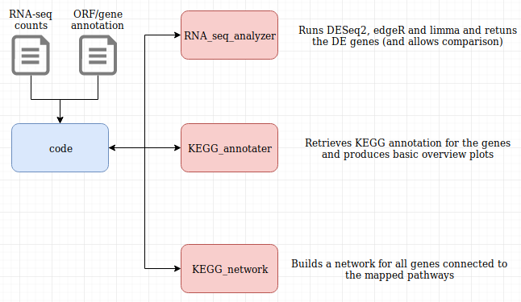
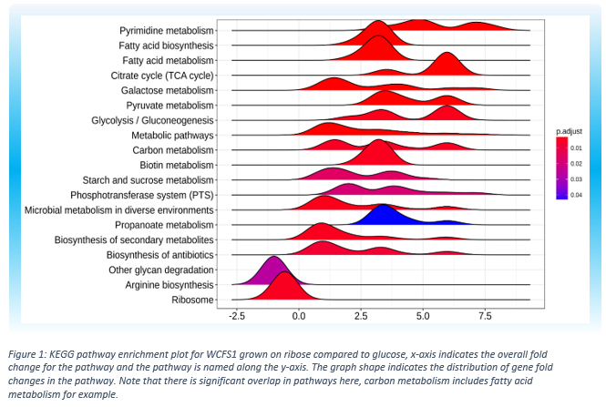
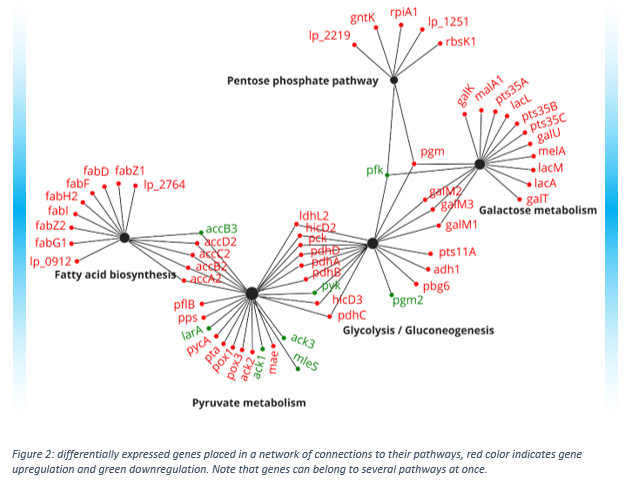
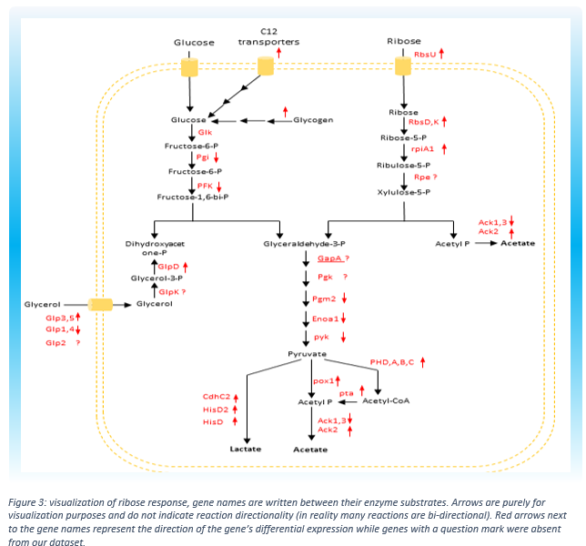

# RNA-seq differential expression and KEGG pathway analysis

A small R pipeline that identifies differentially expressed genes from bacterial RNA-seq counts and maps them onto KEGG pathways. It compares three differential expression methods (DESeq2, edgeR, limma) and builds custom KEGG pathway figures and networks.

This was a 2018 bioinformatics course project at HAN University of Applied Sciences, written together with Rick Beeloo and Thomas Reinders. The analysis looks at the difference between ribose and glucose growth media for the Lactobacillus plantarum WCFS1 strain.

## Overview



The main script (`scripts/main_code.R`) reads the RNA-seq counts and their annotation, then feeds them to the `RNA.seq.analyzer` class:

```R
wcfs1 <- new('RNA.seq.analyzer', count.data[,1:4], anno)
```

Low counts are filtered first, since they are not meaningful. The pipeline can then run DESeq2, edgeR, or limma separately or together. Each method performs its own normalization and model-fitting steps, and the results are formatted into a common data frame (same headers and the same p-value correction) so they can be compared directly:

```
              pvalue    adjpvalue       logFC
lp_0001 0.5935160931 0.7216653664 -0.09095857
lp_0002 0.1901134166 0.3198894710 -0.20621807
...
```

Because there is ongoing debate about which method is best, the pipeline can draw a Venn diagram of the three methods showing overlapping and non-overlapping genes. We continued the analysis with the edgeR result; the intersection of all three is available through `wcfs1@venn.data$limmaedgerdeseq2`.

### KEGG analysis

We initially used clusterProfiler for the KEGG step. Several of its plots were useful (ridgeplot, emapplot, heatplot; see part II of `scripts/main_code.R`), but the enrichment was unreliable because only orthologous genes were available. A key pathway, the pentose phosphate pathway, was not significantly enriched even though it contained ribose-operon genes with fold changes above 8, while the regulator rbsR was upregulated far less (logFC about 1.5). This motivated a custom implementation in the `KEGG.annotater` class. It retrieves KEGG data for the organism (here `lpl`, Lactobacillus plantarum), couples it to the full gene set and the DE gene set, and filters for pathways of interest such as glycolysis, the pentose phosphate pathway, and pyruvate metabolism (see the code for the full list).

We liked the layout of the clusterProfiler `cnetplot`, but it did not cover all pathways of interest and did not allow control over colors, node forces, or edge widths. The `KEGG.network` class therefore uses networkD3 to produce a similar plot with more control over those parameters, and it saves a self-contained HTML widget (which can be exported to SVG by hand for figures).

## S4 class design

R supports several object systems (S3, S4, R5). We used S4 classes, which are increasingly common in R packages, to structure the whole analysis. There are three:

- `RNA.seq.analyzer` (`scripts/RNA_seq_analyzer.R`): determines the contrast from the column names of the count matrix, then tests it with DESeq2, edgeR, and limma.
- `KEGG.annotater` (`scripts/KEGG_annotater.R`): uses the DE gene locus tags to retrieve information from the KEGG database.
- `KEGG.network` (`scripts/KEGG_network.R`): draws a network of the differentially expressed genes, colored red and green for up- and down-regulation.

S4 encapsulates the data inside the objects: slots are declared at initialization and their contents can be read with `@` (for example `wcfs1@edger.de` for the edgeR DE genes). One trade-off is that a method cannot easily call another method of the same object, which leads to some long methods.

## Biological interpretation

We focused on the difference between ribose and glucose growth media for the WCFS1 L. plantarum strain. All genes were mapped to their pathways, followed by an enrichment analysis (clusterProfiler, figure 1).



Most pathways the genes mapped to were upregulated, with only arginine and ribosome biosynthesis downregulated. Because these pathways consist of interconnected genes, an overall fold change reveals global changes but does not pinpoint specific fluxes, nor does it show pathway connections. We therefore drew a network of the genes and the pathways they participate in (figure 2).



With the genes mapped back to their pathways, the overall upregulation still contains downregulated genes. A notable one is pfk, a key glycolysis enzyme; its downregulation suggests glycolysis is inhibited, while upregulation of other glycolysis and gluconeogenesis genes indicates increased gluconeogenesis. This matches expectation: in a ribose-rich, glucose-poor medium it is sensible for WCFS1 to favor glucose construction. Genes for glycogen breakdown are also upregulated, providing another glucose source. Figure 3 summarizes the most relevant genes and the substrates of their enzymes.



Ribose import is upregulated, as expected when ribose is the only likely energy source in the growth medium. Pyruvate breakdown also appears strongly upregulated; the biological explanation is unclear. We compared our results with a [similar study in L. sakei](https://www.ncbi.nlm.nih.gov/pmc/articles/PMC3146418/), which showed close agreement in pathway patterns, including in the detailed figure 3 (apart from a few genes our dataset lacked).

## Requirements and running

The pipeline uses R with Bioconductor. Key packages: DESeq2, edgeR, limma, clusterProfiler, pathview, networkD3, VennDiagram, enrichplot (installed from GitHub), and the tidyverse packages tibble, tidyr, dplyr, ggplot2, ggraph.

Run from the repository root so the relative `source()` and data paths resolve:

```R
source('scripts/main_code.R')
```

Input data is in `data/` and the figures used above are in `images/`. Generated outputs (pathway images, DE gene tables, the network HTML) are written at runtime and are not tracked.

## Known limitations

This was a course project, and a few rough edges are kept as-is rather than silently rewritten:

- `scripts/main_code.R` calls `setwd('/output')` before saving results, which points at an absolute path rather than a folder relative to the project. Adjust the working directory before running.
- Contrast detection in `RNA.seq.analyzer` parses sample names with `gsub("\\.1|.2", "", ...)` and assumes an `x.1 x.2` naming scheme; the second alternative is an unescaped pattern that matches more than intended.
- Some methods write to the global environment (for example `keep <<-` in `filter.low.counts`), and `map.kegg.pathway` reads the global `wcfs1` object directly instead of its own slots, so those methods are coupled to specific variable names.

## Credits and license

Written by Rick Beeloo, Koen van der Heide, and Thomas Reinders (HAN University of Applied Sciences, 2018). The Venn set-extraction helper in `scripts/venn.extract.R` is adapted from a [Stack Overflow answer](https://stackoverflow.com/questions/23559371/how-to-get-the-list-of-items-in-venn-diagram-in-r) and is licensed CC BY-SA 3.0, not under this repository's MIT license.

The original R code is released under the MIT License (see `LICENSE`), except `scripts/venn.extract.R` (CC BY-SA 3.0, noted above). The RNA-seq count data and annotation in `data/` are identified by their file headers as Todt/HAN course material; no license is granted for the data, and reuse requires permission from the original rights holder.
